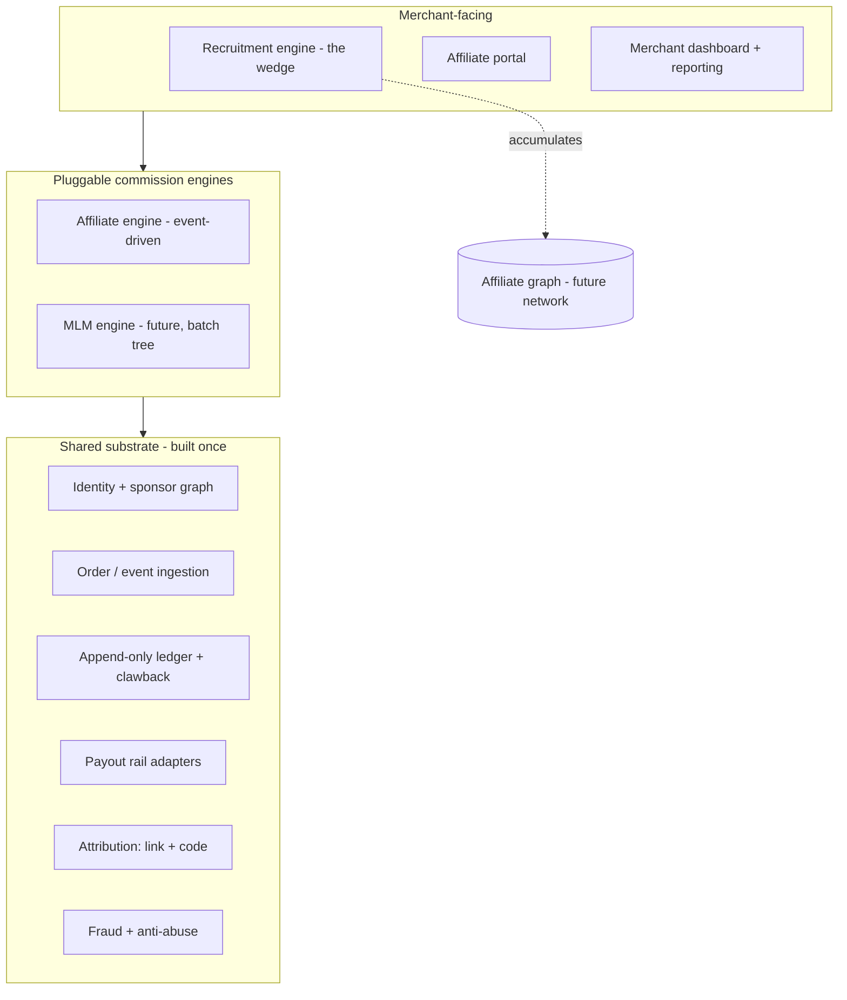
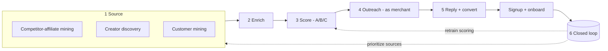
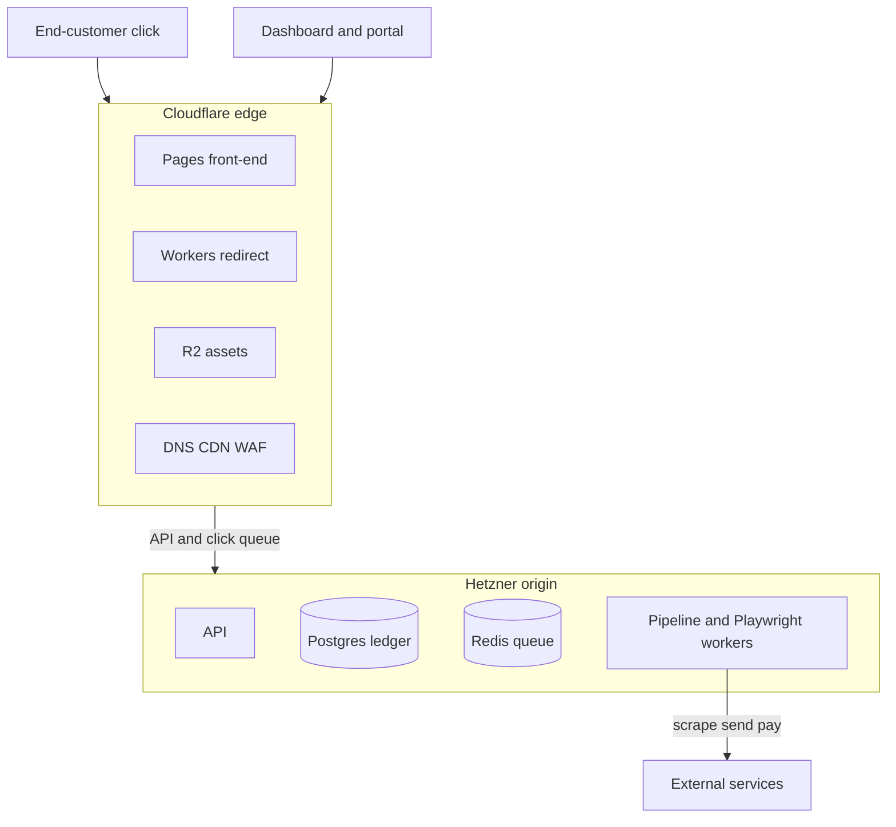

# Affiliate Platform — Comprehensive Build Plan

A merchant-focused affiliate program management platform. Tracking is table stakes; the differentiator is **recruitment** — actively helping merchants find, score, and sign affiliates, as automatically as the system allows. Built on a shared substrate with a **pluggable commission engine**, so the affiliate engine ships first and an MLM/direct-selling engine remains a future option on the same chassis. The marketplace is deferred and treated as a graph that accumulates as a byproduct of recruitment, not a launch.

This document supersedes the earlier outline.

---

## 1. Thesis and non-goals

**Sold to merchants, not affiliates.** The merchant is the tenant and the payer.

The strategy rests on three bets:

- **Tracking is a commodity.** Rewardful, FirstPromoter, Refersion, Tapfiliate, PartnerStack, and Post Affiliate Pro all do tracking, a portal, and payouts competently. It is the price of entry, not the reason anyone switches.
- **The wedge is recruitment.** The merchant's real unsolved pain is *supply* — they launch a program and have no affiliates. Almost every tool hands them tracking and a dashboard and abandons them at "now go find affiliates." Solving that is the insertion point, and it is a different problem from tracking (sourcing + outreach, i.e. lead-gen, not analytics).
- **The network is emergent.** Every affiliate recruited across all merchants becomes a node in a graph the platform owns — the supply side a network needs, accumulated as a byproduct. The network can be exposed later without a cold-start gamble. Optional upside, not a dependency.

The core wager: **merchants will pay to be made good at recruiting**, rather than waiting for a network to hand them affiliates. That dodges cold-start and is defensible. Merchants who would rather have supply handed to them convert later, through the emergent network.

**Non-goals (deliberately out of scope, at least initially):**

- Not the **merchant of record** — each merchant runs their own checkout; the platform tracks and pays commissions only. This avoids retail payment processing, PCI scope on the sale, and retail-side chargebacks.
- Not building **MLM/direct-selling** now — but the architecture keeps it a clean future option (Section 5, Section 12).
- Not building an **affiliate-side marketplace** now — the graph is accumulated first.

### Responsibility model and packaging

The boundary that defines the product:

- **Merchant decides the rules** — rates, tiers, terms, who's approved. Configuration; theirs.
- **Platform computes who gets what** — attribution, ledger, commission and override math, from those rules and tracked conversions. This is the product and is *never* offloaded to the merchant; if the merchant computes commissions, there is nothing to sell.
- **Platform orchestrates payment without custody** — disburses from the merchant's connected payout rail through adapter integrations (Section 4). A feature, not a liability.
- **Affiliate self-certifies tax info; the rail or merchant files** — the platform is neither verifier nor filer (Section 4).

The instinct to offload is right for money custody and tax liability, and wrong for commission computation — that last one is the value, and it always stays with the platform.

**Packaging (open).** Tiers should gate on *operational involvement* — how much of the payout-and-admin operation the platform runs — not on computation, which is always 100% the platform's. The specific feature-to-tier mapping is undecided; the axis runs roughly from track-and-export (merchant pays out and handles their own docs) through managed payouts (orchestrated from the connected rail, gated on tax-form collection) to done-for-you (managed payouts plus the recruitment engine run as a service — the highest-margin tier, because it's the wedge nobody else offers). Treat the exact gating as an open product decision.

---

## 2. Architectural principles

Five load-bearing decisions everything else follows from:

1. **Merchant-as-tenant, multi-tenant throughout.** Isolation of data, mailboxes, sending domains, suppression lists, and rate budgets per merchant.
2. **Global affiliate identity + per-merchant relationships.** An affiliate is a global entity; the link to a merchant is a join record. This is what keeps the network an option — the affiliate graph spans merchants natively. Siloing affiliates per merchant would force a painful migration later.
3. **Pluggable commission engine over a shared substrate.** The substrate (identity, orders, ledger, payouts, attribution, fraud) is built once. The *calculation* logic sits behind an interface. The affiliate engine is the first implementation; an MLM engine can be a second one on the same base. Same chassis, different transmission.
4. **Not merchant of record; rail-agnostic payout orchestration.** The platform computes payable balances and triggers disbursement through connected payout rails; the rail remains the regulated money-mover and handles its own onboarding/KYC obligations.
5. **Edge-isolated tracking hot path.** The click-redirect endpoint runs on edge compute, decoupled from the heavy recruitment pipeline, so a job backlog never slows redirects.

---

## 3. System architecture



Three tiers: a **shared substrate** at the bottom, **pluggable commission engines** above it, and **merchant-facing features** on top — with the **recruitment engine** running as a parallel pipeline that feeds the identity graph (and, eventually, the network).

---

## 4. The shared substrate (built once)

Everything here is reused by every commission engine and most features.

**Identity and relationship graph.** Global `affiliates`, plus `affiliate_relationships` carrying the per-merchant join and a `sponsor_affiliate_id` self-referential pointer (the recruiter). That pointer is the seed of everything downstream — a two-tier override walks it one level; an MLM genealogy walks it to depth. Same primitive, different traversal.

**Order / event ingestion.** A single path that normalizes "an order happened, amount X, attributed to entity Y" from Shopify, WooCommerce, Stripe webhooks, and server-to-server postbacks. Both the affiliate and a future MLM engine consume from here.

**Append-only ledger + reversal/clawback.** Immutable money-event log with states (`pending → approved → paid`, or `reversed`). Never mutate balances. On refund, a reversal cascades through whatever commission entries the order produced (one level for two-tier; the full upline for MLM) — same pattern, parameterized by depth.

**Payouts — orchestration without custody.** The default model: the platform computes commissions, then triggers payouts that flow *from the merchant's own connected rail directly to affiliates* through payout adapters — Stripe Connect first unless merchant validation points elsewhere, with PayPal Payouts and Wise as natural additional rails. The platform conducts (compute, approve, batch, disburse, threshold, hold, statement, retry); it does not hold funds. This is the position that keeps the whole system legally lighter than custody. Three positions exist on the custody spectrum — *punt* (compute only, merchant pays however), *orchestrate without custody* (default), and *hold float* (pre-funded balance, platform disburses) — and float is deliberately deferred: it becomes relevant only if the network is built, or to guarantee payment independent of the merchant, or to take a payment margin, each of which means taking on money-services work on purpose. Multi-currency throughout.

**Tax — delegated to the rail, never the platform's liability.** Three jobs to keep separate: *collecting* a form, *verifying* it, and *filing*. The platform owns only the lightest — it **gates payout on a tax form being on file** (no form, no payout; fully automatic, and it protects the merchant). Affiliates self-certify (W-9 / W-8BEN under penalty of perjury), so accuracy liability sits with the signer; nobody verifies manually, and automated TIN matching is the most that's done. Collection and filing are delegated to the payment rail when supported, or fall to the merchant as payer of record. The platform is **neither verifier nor filer**. Cross-border payees and Malaysia-side reporting add withholding wrinkles for separate legal review; the architectural rule holds regardless. Not tax advice — confirm current rules and thresholds when building, as they shift.

**Attribution primitives.** Two mechanisms, both reusable: **link/click** attribution (Section 6) and **code** attribution (Section 7). A configurable priority rule resolves conflicts.

**Fraud + anti-abuse.** IP velocity and datacenter/VPN flagging, click-to-conversion timing checks, per-affiliate reversal-rate monitoring, fingerprinting, self-referral and circular-sponsorship prevention, and a human-review queue for flagged conversions.

**Cross-cutting:** multi-tenant auth, tenant-scoped RBAC, audit logs, a reporting framework, usage/billing events, privacy controls for affiliate/prospect PII, secrets management, and observability.

---

## 5. The commission engine interface (the seam)

The single decision that future-proofs the platform. Commission calculation lives behind a narrow interface; the substrate calls it, the engine returns money events to write to the ledger:

```
interface CommissionEngine {
  onOrder(order, attribution) -> CommissionEvent[]   // event-driven path (affiliate)
  runCycle(period)           -> CommissionEvent[]     // batch path (MLM commission runs)
  onReversal(order)          -> ReversalEvent[]        // clawback cascade
  qualify(entity, context)   -> Qualification          // tiers / ranks
}
```

**Affiliate engine (first implementation, event-driven).** A sale fires → apply the offer's rate → optionally walk the sponsor pointer up one level for a two-tier override → emit commission events. `runCycle` is largely a no-op (payout batching only). Shallow and immediate.

**MLM engine (future, batch + stateful).** `runCycle` does the real work: traverse the full genealogy, roll up personal and group volume, balance binary legs with carryover state between cycles, handle matrix spillover, evaluate rank qualifications, distribute bonus pools. Plus volume tracking (PV/GV), a rank/qualification subsystem, and compliance machinery (real-customer/retail-sales verification, buyback accounting). This is a substantial separate build and a *distinct vertical* — different payment rails (Stripe restricts MLM), licensed merchants, and the compliance tooling *is* the product. The architecture makes it possible later; it is not a config flag.

Designing this seam from the start — even while only the affiliate engine exists — is what prevents affiliate logic from welding into the foundation.

---

## 6. Tracking engine (the affiliate engine's capture side)

**Redirect hot path.** Links resolve through an edge endpoint (`track.you.com/c/{code}`): decode `affiliate_id` + `offer_id`, mint a time-sortable `click_id` (UUIDv7), set a first-party cookie, append `click_id` to the destination, 302-redirect immediately. Write the click record asynchronously — never block the redirect. Sub-50ms globally on edge compute.

**Conversion capture.** The robust path is a **signed server-to-server postback**: the `click_id` rides through the funnel and the merchant's server calls the postback endpoint on conversion, HMAC-signed with a per-merchant secret and deduplicated on a merchant-supplied `txn_id`. An open or unsigned endpoint is the classic way these systems get drained by forged conversions.

**Attribution.** Match deterministically on `click_id`; fall back to last-click-within-window from the cookie only when no id is present. Configurable attribution window per offer.

**Merchant integration surface — the operational core.** Because the platform does not own the checkout, the numbers are only as good as each merchant's implementation. Ship: signed S2S postback, a Stripe-webhook path, drop-in plugins for Shopify and WooCommerce, a **validation/test tool** so a merchant confirms conversions fire before going live, and tamper-resistance so a merchant cannot quietly under-report. If affiliates suspect conversions are leaking, they leave — making integration reliability a priority, not a feature.

---

## 7. Program mechanics that drive merchant success

A program succeeds on two axes — **motivation** (do affiliates promote hard?) and **attribution** (does credit get captured?). Configured per program by the merchant.

**Affiliate roles — seller and recruiter.** Affiliates opt into a role when joining a program: a **seller** earns commission on their own sales (the standard affiliate), and a **recruiter** earns when affiliates they brought in make sales — a two-tier override via the `sponsor_affiliate_id` pointer. A merchant can offer one or both, and may allow `both`. Recruiter pay is set by an **override policy** per program, in one of two forms: **flat** (a fixed amount — the "cash" option) or **percentage** (a cut of the recruit's sales), with a configurable trigger (the recruit's first sale, or every sale). Mechanic: on a qualifying conversion, walk the sponsor pointer one level, confirm the sponsor holds the recruiter role, and write an `overrides` entry per the policy; clawbacks cascade. Hard constraints (unchanged): overrides — flat or percentage — are **strictly contingent on the recruit's real sales**, never paid for the signup or buy-in itself (that is the pyramid line), with a **two-tier depth cap**. These primitives (role + sponsor pointer + override policy + overrides ledger) are also the MLM foundation; the future MLM engine generalizes them to depth, volume, and ranks (Section 5, Section 12).

**Code-based attribution.** Unique per-affiliate codes capture credit where links can't — podcasts, video, offline, cross-device — and pair naturally with creator recruitment. Two kinds: **discount** (customer incentive + attribution; best capture, costs margin) and **referral** (pure attribution; preserves margin, lower capture); merchant chooses per program. Sync codes as discount/promo codes into Shopify/WooCommerce/Stripe; on conversion the webhook carries the code used. A configurable **priority rule** resolves link-vs-code conflicts. **Leak protection:** non-guessable codes, usage caps, expiry, coupon-stacking rules, and monitoring for codes surfacing on coupon-aggregator domains (Honey, RetailMeNot) to catch attribution theft and unintended discounting.

**Commission options (per offer).** Tiered/volume commissions (rate escalates with volume — the strongest mid-tier motivator), milestone bonuses (flat reward at thresholds — cheap activation driver), recurring commissions (pay on every rebill — essential for subscription merchants; requires rebill events to fire postbacks), time-limited boosts ("double commission this week"), SKU/category-specific rates, first-order-only or new-customer-only commissions, caps, exclusions, and custom negotiated terms for VIP affiliates.

**Program rules and guardrails.** Merchants need explicit controls, not support tickets: excluded products, excluded coupons, commissionable subtotal definition (gross, net of discount, net of tax/shipping), payout hold period, refund/cancellation reversal rules, cookie window, link-vs-code precedence, geo restrictions, allowed traffic sources, PPC / brand-bidding policy, trademark terms, self-referral policy, content disclosure requirements, and manual-review thresholds for high-value or suspicious conversions.

**Gamification.** Leaderboards (public/private), time-boxed contests, and affiliate tiers (Bronze/Silver/Gold with escalating rates and perks). Competition reliably lifts top performers and re-activates the middle of the roster.

**Optional: customer referral program.** "Refer a friend" (both sides rewarded) is a related but distinct mechanic; codes and overrides serve it too. Supporting it widens the addressable merchant base — a scope decision, not a requirement.

---

## 8. The recruitment engine — the wedge

The part that justifies the product: a specialized outbound pipeline retargeted from "find sales leads" to "find affiliates." Six stages, as automated as possible, with human-in-the-loop only where judgment changes the outcome.



The distinction to keep straight: **targeting is the moat, sending is the mechanism.** Anyone can send cold email. Finding the right people — and knowing which will actually drive sales — is what nobody else does well. Weight engineering effort accordingly.

### 8.1 Sourcing / discovery

For a given merchant (niche, product, competitors, customer profile), assemble candidates. By signal strength:

- **Competitor-affiliate mining — the headline feature.** Identify the merchant's competitors, then find who already promotes them. SERP scraping for `"{competitor} review"`, `"{competitor} coupon"`, `"best {category}"`, `"{competitor} vs"`; backlink analysis of competitor domains; and **affiliate-link-pattern detection in the wild** — scan pages for outbound links matching known affiliate signatures (network redirect domains, `?ref=` / `/aff/` / coupon params, `amzn.to` + tag, ClickBank hoplinks, ShareASale/Impact/Awin/CJ patterns). Anyone with these is a *proven* affiliate, in the *exact* niche, already promoting a *direct competitor* — the warmest target and the strongest predictor of producing sales.
- **Creator discovery.** YouTube channels covering the category (filter by reach, check descriptions for a business email and existing affiliate links), SEO/content blogs ranking for niche terms, newsletters (Substack, beehiiv), podcasts, and where feasible Instagram/TikTok creators.
- **Customer mining — warmest, highest-converting.** From the merchant's own Shopify/Stripe/email data, surface engaged customers, repeat buyers, and high-NPS accounts, then enrich to find which are themselves creators. Existing customers convert to producing affiliates far better than any cold source. Feeds the auto-invite flow (Section 9).
- **Community and directory mining.** Niche subreddits, Facebook groups, forums, public affiliate directories.

Each method emits raw candidate records tagged with source and initial signals. This is scraping-heavy: build resilient headless-browser workers (Playwright) with proxy rotation, prefer official APIs (backlinks, creator data) where they exist, and isolate failures so one broken source never stalls the pipeline.

### 8.2 Enrichment

Turn a discovered entity into a contactable, scoreable record:

- **Identity resolution** — site → owner, channel → person, handle → real contact.
- **Email discovery + verification** — pattern generation plus MX/SMTP verification, or finders (Hunter, Apollo, Findymail, Prospeo, Dropcontact). Verify before sending; unverified sends destroy deliverability.
- **Signal gathering** — traffic, audience size, domain authority, niche relevance, affiliate disclosures (proven monetizer), engagement rate (not raw follower count), content recency, contact channels.
- **Dedup and suppression** — against existing affiliates, prior outreach, global unsubscribes, and bounces.

### 8.3 Scoring

Rank prospects so the best are contacted first and with the most effort. A composite **fit + propensity score**:

- **Relevance** — topical match between the prospect's content and the merchant's product (ideal use of embeddings: embed both, score similarity).
- **Affiliate-propensity** — already runs affiliate links (strong positive); already promotes a direct competitor (strongest). Heaviest weight.
- **Reach** — audience size.
- **Quality** — domain authority and, crucially, *engagement rate*.
- **Commercial intent** — produces reviews / comparisons / "best of" (high-converting) vs general content.
- **Contactability** — verified email or clear path.
- **Audience overlap** — geography, language, demographic alignment with the merchant's customers.

Combine into a weighted score, bucket into **A / B / C tiers** — tier drives outreach intensity, personalization depth, and whether a human reviews before sending.

**Closed-loop scoring (the compounding part).** Start heuristic. As outcome labels accumulate (recruited → produced sales → how much), evolve toward a learned model targeting **"will drive sales,"** not "will reply" — optimizing for replies alone fills programs with non-producers. Feeding real revenue outcomes back into the score is what makes the engine improve as the graph grows, and is the direct expression of the data moat.

### 8.4 Outreach

Automated, personalized in proportion to score.

- **Send as the merchant, not the platform.** Outreach goes from the merchant's connected mailbox (Gmail / Microsoft Graph OAuth, or SMTP) under the merchant's identity. Converts better, is authentic, and protects platform domain reputation from cold-send blowback. For volume beyond a mailbox's safe limits, provision per-merchant secondary sending domains with SPF/DKIM/DMARC and warmup.
- **Personalization, tiered by score.** LLM-generated, template-constrained, referencing the prospect's specific content + the merchant's offer + commission + a concrete fit angle. A-tier gets deep personalization with optional human review; C-tier light token personalization. Keep the merchant's voice; avoid AI-cold-email tells.
- **Sequencing.** Multi-step cadence (initial → follow-ups → breakup) with hard stops on reply and conversion, respecting send windows and per-mailbox daily caps.
- **Deliverability operations.** Warmup, rotation, bounce/complaint handling, spam-trigger avoidance, continuous inbox-placement monitoring. An ongoing ops function, not a setup step — the silent failure mode of every cold-outreach system.

### 8.5 Reply handling and conversion

- **Ingest** replies via IMAP or provider webhook.
- **Classify** with an LLM: interested / question / not interested / out-of-office / unsubscribe.
- **Route** — auto-suppress unsubscribes and bounces; send interested and question replies to a human-in-the-loop approval/handoff queue, or to an AI-SDR agent that answers common questions and drives to signup. The interested-reply handoff is the single highest-value HITL checkpoint — a warm reply mishandled is a recruited affiliate lost.
- **Convert** — signup link → join → enablement (links, assets) → onboarding sequence → first-promotion nudge.

### 8.6 Closed-loop learning

Instrument the full funnel — `sourced → contacted → replied → signed up → first sale → producing` — and feed outcomes to three places: **scoring** (retrain on who produced), **sourcing** (prioritize sources/segments that yield producers, prune the rest), and **outreach** (which angles and templates convert). This loop turns a static scraper-mailer into a system that improves the more it runs.

### 8.7 Orchestration architecture

An async, multi-stage system with external API calls, per-API rate limits, human checkpoints, and strict per-tenant isolation:

- **Per-prospect state machine:** `discovered → enriched → scored → queued → contacted → in_sequence → replied → converted` (terminal: `dead`, `suppressed`, `bounced`).
- **Job queue + stage workers** — each stage a worker pool over a durable queue; idempotent jobs, retries with backoff, per-external-API rate governors.
- **HITL checkpoints** as an in-app approval queue (optionally mirrored to a chat channel for fast mobile approvals): A-tier outreach, interested replies, borderline scores.
- **Scheduler** enforcing send windows, per-mailbox caps, follow-up timing.
- **Per-tenant isolation** of mailboxes, domains, suppression lists, rate budgets.
- **Observability** — per-merchant recruitment-funnel dashboards and per-stage health.

### 8.8 Recruitment campaign UX

The engine needs an operator surface, not just background jobs:

- **Merchant ICP setup** — product/category, ideal affiliate types, target geos/languages, excluded geos, competitors, disallowed channels, preferred creator size, tone, and offer hooks.
- **Competitor and source editor** — merchants can add/remove competitors, seed keywords, approve source types, and see which sources produce affiliates.
- **Prospect review queue** — prospect profile, source evidence, discovered pages/videos, contact info confidence, score explanation, suppression history, and one-click approve/reject.
- **Campaign controls** — templates, sequence steps, send windows, daily caps, mailbox/domain assignment, A/B tests, and pause/kill switches.
- **Explainability** — show why a prospect is A/B/C tier: competitor promoted, affiliate links detected, relevant keywords, reach, engagement, contactability, and geo/audience fit.
- **Exclusion controls** — blacklist domains, agencies, coupon farms, competitors, countries, and sensitive categories; whitelist strategic targets for higher-touch handling.
- **Outcome feedback** — mark bad fit, wrong contact, not an affiliate, already partnered, competitor exclusive, or high-potential; feed that label back into scoring and sourcing.

### 8.9 Compliance (woven through)

- **US (CAN-SPAM):** permissible for B2B cold email if compliant — accurate headers, valid physical address, no deceptive subjects, honored opt-outs.
- **EU (GDPR/ePrivacy):** unsolicited B2B cold email is restricted; legitimate-interest is shaky. Geo-gate or apply a stricter basis for EU contacts.
- **Canada (CASL):** consent-based and strict; treat as high-risk.
- **Always:** global suppression, one-click unsubscribe honored across all merchants, bounce/complaint handling, accurate sender identity.

Sending as the merchant improves deliverability and authenticity, but the platform still bears responsibility for what it enables — bake compliance in rather than delegating it, and get legal review before scaling outreach volume.

---

## 9. Program management surface

The merchant-facing breadth. Most of this is CRUD and integration against documented APIs — cheap to build comprehensively with AI coding, and worth doing upfront. Items that are correctness-, calendar-, or compliance-gated are flagged and follow the discipline in Section 12, not the "afternoon" rule.

### Merchant launch / onboarding

The first product experience should be a guided launch system, because affiliate programs fail when setup is half-done. Checklist:

- Connect store / checkout source (Shopify, WooCommerce, Stripe, S2S postback).
- Connect payout rail and define payout schedule, hold period, minimum threshold, currency, and tax-form gate.
- Connect mailbox and sending domain for recruitment; verify SPF/DKIM/DMARC where applicable.
- Create first program/offer: commission rules, cookie window, code/link priority, eligible products, and approval mode.
- Add affiliate agreement, program terms, brand-bidding policy, disclosure requirements, and prohibited traffic sources.
- Upload creatives, swipe copy, product feed, and default landing pages.
- Run test click, test code, test conversion, refund/clawback simulation, and payout dry run before launch.
- Invite first affiliates, approve first outbound campaign, and confirm dashboards/reporting are populated.

### Affiliate lifecycle (inbound)

The outbound recruitment engine (Section 8) is one supply path; affiliates also apply directly.

- **Application + approval.** Customizable signup forms per program, an approval/rejection queue, auto-approve rules, and vetting (traffic source, site review).
- **Affiliate groups / segments.** Group affiliates with differentiated commission terms, creatives, and rules per group (the per-relationship `commission_terms` made explicit and manageable).
- **Onboarding + agreements.** Affiliate terms-of-service acceptance (recorded), onboarding sequences, first-promotion nudges.
- **Status management.** Active / paused / banned, with reason and audit trail.

### Affiliate CRM

Recruitment does not end at signup. Merchants need a lightweight relationship system: notes, tags, owner assignment, tasks, follow-up reminders, message history, negotiated private terms, VIP status, preferred channels, last contact, next action, and manual bonuses. Treat affiliates less like rows in a report and more like a revenue partner list.

### Enablement / portal

Per-affiliate links and unique codes, deep links to any product page, a creative/asset library (banners, swipe copy, multi-size and dynamic creatives), product feeds/catalogs for content sites, QR codes for offline, and a branded affiliate dashboard with each affiliate's own stats, links, codes, and earnings.

### Engagement

Onboarding sequences, milestone nudges, dormant-affiliate reactivation (programs die from silence), payout notifications, and program announcements/newsletters.

### Reporting

Merchant ROI, **LTV and cohort analysis of affiliate-acquired customers** (not just clicks — this proves the program's value), affiliate-level performance, recruitment-funnel analytics (8.6), a custom report builder, and scheduled/emailed reports.

### Payout operations

The platform needs an operator-grade payout console: payable balances, pending/approved/held/paid aging, payout batches, merchant approval flow, failed payout retries, minimum thresholds, negative balances after refunds, reserves/holds, manual adjustments, affiliate statements, payout receipts, dispute notes, and merchant liability reports. This is where trust is won or lost after commissions are calculated.

### Integrations

- **E-commerce:** Shopify, WooCommerce (+ the validation tool from Section 6).
- **Payments:** Stripe.
- **Subscription billing (correctness-gated):** Stripe Billing, Chargebee, Recurly — required for recurring commissions to catch rebill events; the recurring-commission feature has a hole without this.
- **Marketing / CRM:** Klaviyo, HubSpot (for customer-to-affiliate and lifecycle).
- **Automation:** Zapier and native webhooks for the long tail.

### API and webhooks

A public REST API (read + write) for merchants and affiliates, outbound webhooks on key events (conversion, approval, payout), API keys with scopes, rate limiting, and developer docs. Table stakes for any technical evaluation and the basis for an integration ecosystem.

### Admin and operations

Team roles and permissions within a merchant account, audit logs, a notifications system (in-app + email), and account settings/branding. Expected the moment you sell past a solo operator.

### Merchant billing and packaging

The merchant is the buyer, so billing is a first-class subsystem: trials, subscriptions, plan gates, usage limits, recruitment credits, enrichment/send overages, failed-payment handling, invoices/receipts, cancellation/reactivation, and internal entitlements. Pricing can map to operational involvement (track/export, managed payouts, done-for-you recruitment), but the product needs the billing rails regardless.

### Privacy, security, and governance

Global affiliate identity and recruitment data make governance part of the product. Include PII encryption where appropriate, tenant isolation, scoped API keys, OAuth token storage, secret rotation, export/delete workflows, source/consent metadata for prospects, data-retention controls, impersonation with audit trail, webhook delivery logs, and least-privilege access for internal operators.

### Quality and compliance monitoring (judgment-gated)

PPC / brand-bidding monitoring (catch affiliates bidding on the brand's trademark keywords), FTC-disclosure checks, coupon-site leak monitoring (Section 7), and self-referral / fraud controls (Section 4). More advanced; expected by larger merchants.

### Deferrable breadth

More payout methods (store credit / gift card, Payoneer, ACH / check), multi-touch attribution beyond last-click, multi-language / localization, and white-label. Standard, safely phased later.

### Adjacent surfaces — deliberately out of scope (different products, not afternoon features)

- **Mobile-app tracking** — an SDK plus MMP integrations (AppsFlyer, Adjust). A separate product surface.
- **Full influencer gifting / seeding** — product seeding, content approval, campaign management.
- **B2B / reseller / agency partner management** — PartnerStack's territory; a different go-to-market and data model.

These complete the *map* of the space, but each is a distinct bet that would dilute the wedge. Add only if the target market shifts.

---

## 10. Data model

```
-- Tenancy
merchants(id, name, status, niche, competitors[], billing_status, default_currency)
merchant_users(id, merchant_id FK, user_id FK, role, status)
audit_logs(id, merchant_id FK, actor_id FK NULL, action, subject_type, subject_id, metadata, ts)

-- Billing and entitlements
billing_subscriptions(id, merchant_id FK, plan, status, trial_ends_at, renews_at)
usage_events(id, merchant_id FK, kind, quantity, source_id, ts)  -- enrichment, sends, active affiliates, etc.
entitlements(id, merchant_id FK, feature, limit_value, source_plan)

-- Merchant setup and integrations
programs(id, merchant_id FK, name, status, terms_url, approval_mode, default_currency)
merchant_integrations(id, merchant_id FK, kind, status, credentials_ref, last_sync_at)
mailboxes(id, merchant_id FK, provider, email, status, daily_cap, warmup_status)
sending_domains(id, merchant_id FK, domain, spf_status, dkim_status, dmarc_status, warmup_status)
webhook_deliveries(id, merchant_id FK, event_type, target_url, status, attempts, last_error, ts)

-- Global identity + relationship graph (substrate)
affiliates(id, name, primary_email, country, audience_profile, status)
payout_accounts(id, affiliate_id FK, rail, account_ref, status, currency)
tax_documents(id, affiliate_id FK, rail, form_type, status, collected_at)
affiliate_relationships(id, affiliate_id FK, merchant_id FK, program_id FK, status, joined_at,
                        commission_terms, source, role, owner_user_id FK NULL, tags[],
                        sponsor_affiliate_id FK NULL)   -- role: seller | recruiter | both; sponsor = recruiter
affiliate_notes(id, relationship_id FK, author_id FK, body, ts)
affiliate_tasks(id, relationship_id FK, owner_user_id FK, title, due_at, status)
affiliate_messages(id, relationship_id FK, direction, channel, subject, body_ref, ts)
agreements(id, merchant_id FK, program_id FK, version, body_ref, effective_at)
agreement_acceptances(id, agreement_id FK, affiliate_id FK, relationship_id FK, accepted_at, ip)

-- Orders, attribution, ledger, payouts (substrate)
offers(id, merchant_id FK, program_id FK, engine, name, payout_type, payout_value, window_days)
offer_rules(id, offer_id FK, kind, config)  -- SKU/category exclusions, caps, geo, traffic rules, etc.
customers(id, merchant_id FK, external_customer_id, email_hash, country, first_seen_at)
orders(id, merchant_id FK, customer_id FK NULL, amount_cents, currency, txn_id UNIQUE, ts)
clicks(click_id PK, merchant_id FK, affiliate_id FK, offer_id FK, ts, ip, ua, landing_url, sub1..5)
conversions(id, click_id FK NULL, order_id FK, affiliate_id FK, code_id FK NULL,
            amount_cents, currency, status, review_status, ts)
ledger(id, merchant_id FK, affiliate_id FK, conversion_id FK, type, amount_cents,
       currency, status, available_at, ts)                                  -- append-only
payout_batches(id, merchant_id FK, rail, currency, status, approved_by FK NULL, ts)
payouts(id, batch_id FK NULL, affiliate_id FK, amount_cents, currency, method, status, ts)
payout_adjustments(id, merchant_id FK, affiliate_id FK, amount_cents, currency, reason, created_by FK, ts)

-- Program mechanics
commission_tiers(id, offer_id FK, min_volume, rate)            -- volume escalation
bonuses(id, offer_id FK, trigger_type, threshold, amount)      -- milestone / activation
affiliate_codes(id, affiliate_id FK, merchant_id FK, code UNIQUE, kind,
                discount_value NULL, usage_cap, expires_at)    -- kind: discount | referral
creatives(id, merchant_id FK, program_id FK, type, name, asset_ref, metadata, status)
override_policy(id, offer_id FK, structure, value, trigger, max_depth)
                -- structure: flat | percentage ; trigger: first_sale | per_sale ; max_depth: 1 (two-tier cap)
overrides(id, conversion_id FK, beneficiary_affiliate_id FK, level, amount_cents)
                -- recruiter earnings; flat or % per override_policy, always sales-triggered

-- Recruitment engine
prospects(id, merchant_id FK, source, identity, site_url, channel_url, state, score, tier,
          country, language, suppression_status)
prospect_sources(id, prospect_id FK, source_type, evidence_url, evidence_summary, captured_at)
prospect_signals(id, prospect_id FK, relevance, reach, da, engagement,
                 is_affiliate, promotes_competitor, intent, verified_email)
outreach_campaigns(id, merchant_id FK, mailbox_id FK, sending_domain_id FK NULL,
                   sequence, send_window, daily_cap, status)
outreach_messages(id, prospect_id FK, campaign_id FK, step, variant, sent_at, status)
replies(id, prospect_id FK, raw, classification, handled_by, ts)
suppression(id, merchant_id FK NULL, email, domain NULL, reason, scope, ts)  -- global + per-merchant

-- Future MLM engine (not built initially)
volume(id, affiliate_id FK, period, pv_cents, gv_cents)
ranks(id, affiliate_id FK, period, rank, qualified)
```

The `engine` field on `offers` is the hook that routes an order to the right commission engine. `affiliates` is global; `affiliate_relationships` carries the per-merchant link and sponsor pointer — the two decisions that keep both the network and MLM as options.

---

## 11. Tech stack and deployment

Chosen on the merits of the workload; substitute equivalents freely.

- **Tracking hot path:** edge compute (e.g. Cloudflare Workers) with an edge queue, isolated from the heavy pipeline.
- **Application core + API:** a single backend (Node or Python) over **Postgres** — the relational shape (global affiliates, per-merchant joins, prospect graphs, ledger) and multi-worker concurrency favor it over SQLite at scale.
- **Pipeline:** a durable job queue with stage worker pools (Redis + BullMQ, or managed), per-prospect state machine, idempotent jobs, per-API rate governors.
- **Scraping/discovery:** headless-browser workers (Playwright) + proxy rotation; official APIs where available.
- **Enrichment:** email-finder APIs + first-party scraping, with SMTP verification.
- **Intelligence:** an LLM/embeddings layer for relevance scoring, personalization, reply classification.
- **Email sending:** merchant-connected mailboxes via Gmail API / Microsoft Graph (or SMTP) + deliverability tooling; secondary domains for scale.
- **Human-in-the-loop:** in-app approval queue, optionally mirrored to a chat channel.
- **Payouts:** payout-adapter layer, with Stripe Connect as the first concrete rail unless merchant validation says otherwise; PayPal Payouts and Wise are natural next adapters.
- **Merchant billing:** subscription billing, entitlements, usage metering, invoices, failed-payment handling.
- **Assets and evidence:** object storage for creatives, agreements, email bodies, screenshots, and prospect-source evidence.
- **Security:** encrypted secret storage for OAuth/API credentials, tenant-scoped authorization, audit logging, and data-retention controls.

### Deployment topology

The system is a hybrid, not a single box — Cloudflare owns the latency-sensitive, globally distributed edge; Hetzner owns the heavy, stateful origin. This is the physical expression of principle 5 (edge-isolated hot path).



- **Cloudflare (edge):** the front-end (Pages, a SPA hitting the API), the click **redirect on Workers** — resolving the link from Workers KV that the backend syncs, minting the `click_id`, setting the cookie, and pushing the click async onto a queue the pipeline drains — plus R2 for assets and DNS/CDN/WAF in front of everything, including the origin (to hide its IP and shield the API and the postback endpoint).
- **Hetzner (origin):** the API, Postgres (the ledger), Redis (queue), and the full recruitment pipeline including the Playwright scrapers. Cheap, beefy compute for long-running scrape / enrich / LLM / send jobs.

The redirect deliberately does **not** live on the Hetzner box: a single-region server serving worldwide clicks adds latency to the most critical always-on endpoint and makes it a single point of failure.

**Hetzner-specific operational rules** (these bite this product in particular):

- **Never send email from the Hetzner IP** — its ranges carry poor sending reputation and sit on blocklists. Recruitment sends already go through the merchant's connected Gmail / MS mailbox (so SMTP is Google/Microsoft, not Hetzner); route transactional email through a reputable ESP (Postmark, SES, Resend). No mail leaves the box's own IP.
- **Scrape through rotating / residential proxies, never the box IP** — datacenter IPs get blocked fast. A hard requirement once the sourcing workers run on Hetzner, not an optimization.
- **Back the ledger up off-box** — money-critical data on a single self-managed Postgres with no off-box backup is the one unrecoverable failure. Automated PITR backups to R2/S3 at minimum; consider managed Postgres for the money store even while the rest stays on Hetzner.
- **No Asian region** — Hetzner is EU/US only, so the dashboard API runs ~150–250ms from Asia (fine for a dashboard; irrelevant for redirects, which are on the edge). Pick US or EU by where the merchants are.
- **Single origin is a SPOF for the API/pipeline** — fine to start, but plan to split Postgres and the workers onto separate hosts as load grows.

---

## 12. Build workstreams

Assume the product is built concurrently rather than as a long phased timeline. The useful grouping is by dependency and verification surface, not calendar order. Three constraints still matter: start **deliverability warmup early** because it is calendar-bound, exercise **money/fraud/compliance** paths as soon as they exist rather than carrying them dormant, and test the **recruitment wedge** against live merchant conditions while the broader CRUD/UI surface is being built.

- **Core substrate + affiliate engine.** Shared substrate *with the commission-engine seam in place*, affiliate (event-driven) engine, tracking capture path, attribution, append-only ledger, reversal/clawback, fraud review, payout-adapter orchestration, and normalized Shopify / Stripe / WooCommerce / S2S ingestion.
- **Merchant operating surface.** Guided launch checklist, program/offer setup, program rules, affiliate portal, affiliate CRM, creative library, engagement automation, payout operations, merchant billing/entitlements, reporting, team roles, audit logs, and governance controls.
- **Recruitment wedge.** Competitor-affiliate sourcing, creator/customer/community discovery, enrichment, heuristic scoring, score explanations, prospect review queue, send-as-merchant sequenced outreach, reply HITL, customer-to-affiliate auto-invite, and deliverability operations.
- **Depth + intelligence.** Closed-loop scoring (heuristic → learned), source-yield pruning, template/angle learning, more source types, gamification, LTV/cohort reporting, and program-health automation.
- **Optional expansion workstreams, enabled by the earlier architecture:**
  - **Network.** Expose the accumulated affiliate graph as a network/marketplace — cold-start already solved because supply was accumulated through recruitment.
  - **MLM / direct-selling engine.** A second commission engine on the same substrate, served as a distinct vertical: licensed merchants, MLM-appropriate payment rails (not Stripe), and the compliance machinery (real-customer/retail-sales verification, buyback) as the product value. Possible because the seam exists from the start; budgeted as a real engine, not a flag.

---

## 13. Metrics and KPIs

- **Recruitment funnel:** sourced → contacted → reply rate → signup rate → activation (first sale) → producing rate; cost per recruited affiliate; **cost per *producing* affiliate** (the number that matters).
- **Recruitment ROI:** producing affiliates by source, revenue by source cohort, payback period on recruitment/enrichment/send cost, and A/B performance by template/angle.
- **Program health (per merchant):** active affiliates, % producing, revenue via affiliates, EPC, refund rate.
- **Affiliate activation:** application approval rate, onboarded-to-first-link rate, first-promotion rate, first-sale rate, dormant/reactivated affiliates, and VIP affiliate retention.
- **Money operations:** unpaid commission liability, payout aging, failed payout rate, held balance, reversal/clawback rate, negative-balance exposure, and manual-adjustment volume.
- **Quality / compliance:** fraud-review rate, rejected conversion rate, brand-bidding violations, coupon leaks, FTC-disclosure findings, unsubscribe/complaint rate by campaign.
- **Deliverability:** bounce rate, complaint rate, inbox placement.
- **Business:** merchant activation, merchant retention, net revenue retention, expansion by operational tier, recruitment-credit usage, and gross margin by enrichment/send provider.

---

## 14. Risks and mitigations

- **Deliverability / domain reputation.** Cold email from shared infrastructure burns domains fast. Mitigate with send-as-merchant from connected mailboxes, per-merchant secondary domains, warmup, volume caps, rotation, monitoring. The most likely thing to quietly break the product.
- **Compliance (outreach).** Geo-sensitive. Geo-gate EU/Canada or apply stricter bases, maintain global suppression and honored opt-outs, include a physical address, get legal review before scaling volume.
- **Payout trust and merchant liability.** The platform may not hold funds, but affiliates experience late or failed payouts as a platform failure. Mitigate with clear payout aging, merchant approval flows, failed-payout retries, held-balance reporting, reserves/holds, and affiliate-visible statements.
- **Single-origin data durability.** The ledger and money state live on one Hetzner Postgres; losing it is unrecoverable. Mitigate with automated off-box PITR backups (to R2/S3) and consider managed Postgres for the money store specifically. See the deployment topology in Section 11.
- **Privacy and PII governance.** Global affiliate identity plus scraped/enriched prospect data creates retention, deletion, access-control, and source-traceability obligations. Mitigate with tenant isolation, scoped access, PII encryption where appropriate, source/consent metadata, retention policies, export/delete workflows, and audit logs.
- **Carried surface, not build time.** With AI coding, breadth is cheap to *build* but not free to *carry*: every feature is maintenance, security, and correctness surface, and dormant code — especially fast-generated code on money, auth, or compliance paths — is where subtle bugs and holes hide. Build breadth comprehensively where it's CRUD/UI; build money / fraud / compliance only when ready to verify it; never carry the latter hidden. The deeper risk is attention — afternoons spent on breadth move neither whether the wedge works nor whether merchants buy.
- **Sourcing quality and scraper fragility.** Start with competitor-affiliate mining (highest signal), prefer APIs, build resilient scrapers with proxy rotation, isolate source failures, let closed-loop learning prune low-yield sources.
- **Scoring for the wrong outcome.** Optimizing for replies fills programs with non-producers. Target *sales*; feed revenue outcomes back into the score.
- **MLM / pyramid line (if the MLM engine is ever built).** The legal test is sales-vs-recruitment, not depth: compensation must come from real sales to real customers, never from recruitment or buy-in to qualify (inventory loading is the textbook pyramid marker). MLM is legal when done right (Amway and others operate freely) but is a *distinct vertical* — payment processors including Stripe restrict MLM, so it needs different rails, and merchants typically need direct-selling licensing (in Malaysia, under the Direct Sales and Anti-Pyramid Scheme Act 1993 via KPDN). Keep it out of the affiliate product; serve it deliberately with the right rails, compliance tooling, and licensed merchants. Get legal counsel before building. (Not legal advice.)
- **The network and MLM bets.** Both kept cheap and optional via the global-identity model and the commission-engine seam — no upfront marketplace build, no premature MLM commitment.
